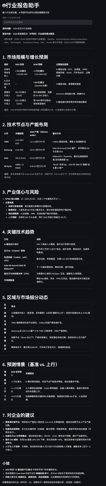

# Industry Report Assistant 📊

An AI-powered tool that generates professional industry report summaries with a streaming (typewriter) effect. Built with [Streamlit](https://streamlit.io/) and [Groq](https://groq.com/) for fast, real-time output.

## Features

- Enter any industry or topic, get a concise report summary
- Real-time streaming output (character-by-character)
- Powered by Groq's high-speed inference
- Simple web interface, deployable with one click

## Demo



## Quick Start

### 1. Clone the repository
```bash
git clone https://github.com/your-username/industry-report-assistant.git
cd industry-report-assistant


# 中文版
# 行业报告助手 📊

基于 Groq 和 Streamlit 的 AI 报告生成工具，支持流式输出。

## 功能
- 输入行业或主题，自动生成专业报告摘要
- 打字机效果逐字输出

## 本地运行
1. 克隆仓库
2. 安装依赖：`pip install -r requirements.txt`
3. 设置环境变量：`export GROQ_API_KEY="your-key"`
4. 运行：`streamlit run app.py`

## 部署到 Streamlit Cloud
1. 将代码推送到 GitHub
2. 登录 [share.streamlit.io](https://share.streamlit.io)
3. 选择仓库，在「Advanced settings」中添加 Secrets：`GROQ_API_KEY = 你的密钥`
4. 点击 Deploy

## 注意事项
- Groq 免费模型会不定期更新，若模型失效，请运行 `groq_model_list.py` 查看可用模型并修改代码。